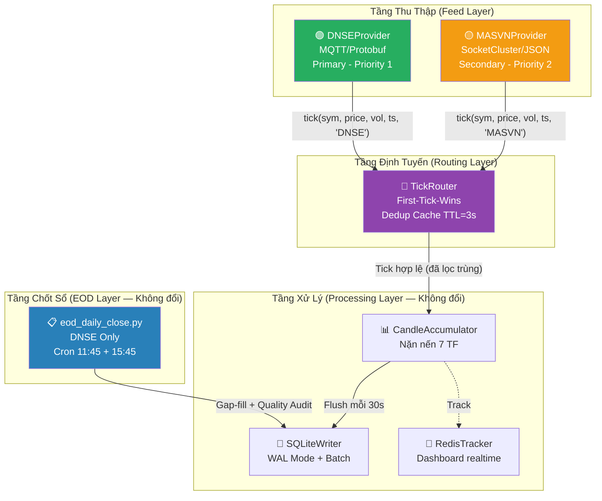

# PA3: Multi-Feed Intraday Engine — First-Tick-Wins

## Bối cảnh & Mục tiêu

Hệ thống hiện tại chỉ hứng Tick từ **1 nguồn: DNSE** (MQTT/WebSocket). Khi DNSE nghẽn mạng hoặc WAF chặn, dữ liệu bị thủng → `MISSING` (1.281 nến) + `LOW_VOL` (4.378 nến) = **tổn thất 7.7%**.

**Mục tiêu:** Nâng SLA thu thập Tick Intraday từ **~92%** lên **99%+** bằng cách hứng song song DNSE + MASVN, thuật toán First-Tick-Wins lọc trùng lặp.

---

## Quyết định Kiến trúc (Đã Duyệt)

### Phân vùng trách nhiệm rõ ràng

| Nhiệm vụ | Vendor | Lý do |
|---|---|---|
| **Tick Realtime (Intraday)** | 🟢 DNSE (Primary) + 🟡 MASVN (Secondary) | MASVN mở Public WebSocket (SocketCluster), không cần Auth, JSON thuần. Hai nguồn bù trừ nhau khi 1 bên nghẽn. |
| **EOD Chốt Phiên (1D, 1W)** | 🟢 DNSE (Duy nhất) | MASVN khoá EOD API bằng WAF F5 BIG-IP, yêu cầu JWT + CAPTCHA → không khả thi cho Bot tự động. DNSE đã chứng minh độ tin cậy 100% qua `eod_daily_close.py`. |
| **Vá dữ liệu phiên sáng** | 🟢 DNSE via `eod_daily_close.py` @ 11:45 | Crontab đã thiết lập, không thay đổi. |

> [!NOTE]
> `eod_daily_close.py` **KHÔNG bị sửa đổi** trong PA3 này. Nó vẫn là "Quan Toà" duy nhất chốt sổ EOD cuối ngày với nguồn sự thật DNSE.

---

## Kiến trúc Tổng thể



---

## Thuật toán First-Tick-Wins + Deduplication

```
Khi nhận tick(symbol, price, volume, timestamp, source):

1. fingerprint = f"{symbol}:{int(timestamp)}"
   (Round timestamp về giây → gộp cùng 1 sự kiện khớp lệnh)

2. Kiểm tra dedup_cache:
   - CHƯA có fingerprint → Chấp nhận ✅
     • Ghi vào cache (TTL = 3s)
     • Chuyển tiếp → CandleAccumulator
     • Tăng counter stats[f"{source}_accepted"]
   - ĐÃ có fingerprint → Bỏ qua ❌
     • Tăng counter stats["dedup_hits"]

3. Mỗi 60s: dọn cache entries cũ hơn 3 giây
```

**Tại sao 1 giây?** Hai vendor phát cùng 1 lệnh khớp trong ~200ms-1000ms.
**Tại sao TTL 3 giây?** Đủ để vendor chậm kịp gửi, đủ nhỏ để RAM không phình.

---

## Proposed Changes

### Component 1: Feed Provider Interface
#### [NEW] [feed_provider.py](file:///Users/tuanho/quant/realtime/feed_provider.py)

Abstract base class cho mọi vendor. Thiết kế tối giản — KHÔNG over-abstract:

```python
from abc import ABC, abstractmethod
from typing import Callable, Awaitable

class FeedProvider(ABC):
    """Interface chuẩn cho mọi nguồn cấp dữ liệu Tick."""
    name: str           # "DNSE", "MASVN"
    is_connected: bool

    @abstractmethod
    async def connect(self) -> bool: ...

    @abstractmethod
    async def disconnect(self): ...

    # Engine sẽ gán callback này sau khi khởi tạo
    on_tick: Callable  # (symbol, price, volume, timestamp, source) -> None
```

---

### Component 2: DNSE Provider (Primary — Tách từ engine hiện tại)
#### [NEW] [dnse_provider.py](file:///Users/tuanho/quant/realtime/dnse_provider.py)

Bốc nguyên khối logic sau ra khỏi `intraday_engine.py`:
- Playwright browser launcher (lấy cookie DNSE)
- Paho MQTT client setup + subscribe topics
- Protobuf decoder (`_decode_boardevent`, `_decode_stockinfo`)
- Reconnect logic

Wrap lại theo interface `FeedProvider`. Khi decode xong 1 tick → gọi `self.on_tick(symbol, price, vol, ts, "DNSE")`.

**Không thay đổi logic nội bộ — chỉ bọc lại.**

---

### Component 3: MASVN Provider (Secondary)
#### [NEW] [masvn_provider.py](file:///Users/tuanho/quant/realtime/masvn_provider.py)

Kết nối Public WebSocket của MASVN:
- **Endpoint:** `wss://mastrade.masvn.com/socketcluster/` (Public, không Auth)
- **Giao thức:** SocketCluster (JSON frames)
- **Handshake:** `{"event":"#handshake","data":{"authToken":null},"cid":1}`
- **Subscribe:** `{"event":"#subscribe","data":{"channel":"market.init"},"cid":2}`
- **Heartbeat:** Tự gửi `{"event":"#2"}` mỗi 15-20s để giữ kết nối
- **Parse:** JSON → trích `symbol`, `matchedPrice`, `totalMatchVolume`, `timestamp`

```python
class MASVNProvider(FeedProvider):
    name = "MASVN"

    async def connect(self):
        # websockets.connect("wss://mastrade.masvn.com/socketcluster/")
        # Gửi handshake + subscribe market channels
        # Spawn _listen_loop() task

    async def _listen_loop(self):
        async for msg in self.ws:
            data = json.loads(msg)
            if data.get("event") == "#publish":
                # Parse tick data
                self.on_tick(symbol, price, volume, ts, "MASVN")
```

---

### Component 4: TickRouter (Bộ não trung tâm)
#### [NEW] [tick_router.py](file:///Users/tuanho/quant/realtime/tick_router.py)

```python
class TickRouter:
    def __init__(self, accumulator, classifier, vol_tracker, redis_tracker):
        self._dedup_cache = {}          # fingerprint → accepted_ts
        self._dedup_ttl = 3.0
        self._stats = defaultdict(int)  # DNSE_accepted, MASVN_accepted, dedup_hits

    def route_tick(self, symbol, price, volume, ts, source):
        fp = f"{symbol}:{int(ts.timestamp())}"
        if fp in self._dedup_cache:
            self._stats["dedup_hits"] += 1
            return
        self._dedup_cache[fp] = time.time()
        self._stats[f"{source}_accepted"] += 1

        # Chuyển tiếp cho CandleAccumulator (logic y hệt engine cũ)
        side = self.classifier.classify(symbol, price)
        self.accumulator.ingest(symbol, price, volume, side, ts)
        self.redis_tracker.track(symbol)

    def cleanup_cache(self):
        """Gọi mỗi 60s — xoá entries cũ hơn TTL."""
        now = time.time()
        self._dedup_cache = {
            k: v for k, v in self._dedup_cache.items()
            if now - v < self._dedup_ttl
        }

    def get_stats(self) -> dict:
        """Cho Heartbeat log."""
        return dict(self._stats)
```

---

### Component 5: Refactor IntradayEngine
#### [MODIFY] [intraday_engine.py](file:///Users/tuanho/quant/realtime/intraday_engine.py)

**Thay đổi chính:**
1. Xoá ~300 dòng logic MQTT/Playwright/Protobuf (đã chuyển sang `dnse_provider.py`)
2. Import `TickRouter` + `DNSEProvider` + `MASVNProvider`
3. `IntradayEngine` trở thành orchestrator gọn gàng:

```python
class IntradayEngine:
    def __init__(self):
        # Processing layer (GIỮ NGUYÊN)
        self.accumulator = CandleAccumulator()
        self.writer = SQLiteWriter(DB_PATH)
        self.classifier = TickClassifier()
        self.vol_tracker = VolumeTracker()
        self.redis_tracker = RedisTickTracker()

        # NEW: Routing layer
        self.router = TickRouter(
            self.accumulator, self.classifier,
            self.vol_tracker, self.redis_tracker
        )

        # NEW: Feed providers
        self.providers: list[FeedProvider] = []

    async def run(self):
        # 1. Khởi tạo providers
        dnse = DNSEProvider()
        dnse.on_tick = self.router.route_tick
        self.providers.append(dnse)

        masvn = MASVNProvider()
        masvn.on_tick = self.router.route_tick
        self.providers.append(masvn)

        # 2. Kết nối song song
        await asyncio.gather(*[p.connect() for p in self.providers])

        # 3. Chạy flush + heartbeat + cache cleanup
        await asyncio.gather(
            self._flush_loop(),
            self._heartbeat_loop(),
            self._dedup_cleanup_loop(),
        )
```

---

### Component 6: Cấu hình
#### [MODIFY] [.env](file:///Users/tuanho/quant/.env)

```env
# MASVN Feed (Vendor B) — Public WebSocket, không cần credentials
MASVN_ENABLED=true
MASVN_WS_URL=wss://mastrade.masvn.com/socketcluster/
```

---

## Trình tự Triển khai (Từng bước an toàn)

### Bước 1: Tách & Refactor (Không thay đổi hành vi)
1. Tạo `feed_provider.py` (interface)
2. Tạo `dnse_provider.py` (bốc code từ engine)
3. Tạo `tick_router.py` (dedup logic)
4. Sửa `intraday_engine.py` → import provider + router
5. ✅ **Checkpoint:** Engine chạy Y HỆT như cũ, chỉ với DNSE provider

### Bước 2: Tích hợp MASVN
1. Tạo `masvn_provider.py`
2. Thêm MASVN vào danh sách providers trong engine
3. ✅ **Checkpoint:** Heartbeat log hiển thị tick từ cả `[DNSE]` + `[MASVN]`

### Bước 3: Kiểm chứng
1. Chạy `/eod vs engine` workflow
2. So sánh tỷ lệ `MISSING` + `LOW_VOL` trước và sau PA3

---

## Verification Plan

### Automated Tests
1. **Unit test TickRouter:** 2 tick trùng (cùng symbol, cùng giây) từ DNSE + MASVN → chỉ 1 được chấp nhận
2. **Smoke test:** Engine khởi động thành công với cả 2 providers

### Manual Verification
1. Log console hiển thị `DNSE_accepted: N, MASVN_accepted: M, dedup_hits: K`
2. Chạy `/eod vs engine` sau phiên giao dịch → đối soát kết quả

### Mục tiêu Đo lường
| Chỉ số | Trước PA3 | Mục tiêu PA3 |
|---|---|---|
| Tỷ lệ OK | 92.3% | **>99%** |
| Nến MISSING | ~1.200 | **<50** |
| Nến LOW_VOL | ~4.300 | **<500** |

---

## Những gì KHÔNG thay đổi

- `eod_daily_close.py` — Giữ nguyên, DNSE là nguồn EOD duy nhất
- `refresh_daily_volume.py` — Không liên quan
- `CandleAccumulator` — Logic nặn nến 7 TF giữ nguyên 100%
- `SQLiteWriter` — WAL mode + batch write giữ nguyên
- Crontab 11:45 + 15:45 — Không thay đổi
