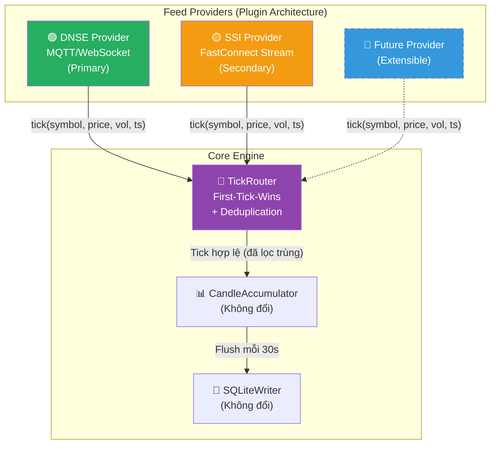

# PA3: Multi-Feed Engine — Hứng Đa Nguồn, Thuật Toán First-Tick-Wins

## Bối cảnh & Mục tiêu

Hiện tại `intraday_engine.py` chỉ hứng Tick từ **1 nguồn duy nhất: DNSE** (qua MQTT/WebSocket). Khi DNSE nghẽn mạng hoặc bị WAF chặn, toàn bộ hệ thống mất trắng dữ liệu → sinh ra lỗ hổng `MISSING` (1.281 nến) và `LOW_VOL` (4.378 nến).

**Mục tiêu:** Nâng SLA thu thập Tick từ **~92%** lên **99%+** bằng cách hứng song song từ nhiều Vendor, dùng thuật toán "Ai nhanh hơn dùng trước" (First-Tick-Wins) kết hợp Deduplication.

---

## User Review Required

> [!IMPORTANT]
> **Quyết định Vendor thứ 2:** Em đề xuất dùng **SSI FastConnect** là Vendor B (phụ). Lý do phân tích chi tiết bên dưới. Anh cần xác nhận **có tài khoản SSI** và đồng ý đăng ký dịch vụ FastConnect API (miễn phí cho khách hàng SSI) không?

> [!WARNING]
> **Phương án TCBS không khả thi** vì TCBS không cung cấp API công khai. Việc reverse-engineer WebSocket nội bộ của TCBS rất bất ổn (hay đổi endpoint, bị chặn IP) và vi phạm ToS. Không nên dùng cho production.

---

## Phân tích Vendor

| Tiêu chí | 🟢 DNSE (Hiện tại) | 🟡 SSI FastConnect | 🔴 TCBS |
|---|---|---|---|
| **Loại API** | MQTT over WebSocket (Reverse-engineered) | WebSocket Streaming (**Chính thức**) | WebSocket nội bộ (Không công khai) |
| **Tính ổn định** | Tốt, nhưng hay bị WAF chặn sau vài giờ | Rất cao — API chính thức có SLA | Bất ổn — hay đổi endpoint |
| **Dữ liệu** | Giá khớp + Volume cộng dồn (Cumulative) | Giá khớp + Volume per-tick + Bid/Ask | Giá khớp + Volume |
| **Xác thực** | Cookie từ Playwright (Session 4-6h) | ConsumerID + ConsumerSecret (Vĩnh viễn) | Cookie session (Bất ổn) |
| **Chi phí** | Miễn phí | Miễn phí (Khách hàng SSI) | N/A |
| **Thư viện** | Tự parse Protobuf | `pip install ssi-fc-data` (Chính thức) | Không có |
| **Rủi ro pháp lý** | Trung bình (Reverse-engineered) | **Không** (API chính thức) | Cao (Vi phạm ToS) |

**Kết luận:** SSI FastConnect là lựa chọn tối ưu nhất cho Vendor B.

---

## Kiến trúc Đề xuất



### Thuật toán First-Tick-Wins + Deduplication

```
Khi nhận tick(symbol, price, volume, timestamp, source):

1. Tính fingerprint = hash(symbol + round(timestamp, 1s))
2. Kiểm tra bảng dedup_cache:
   - Nếu fingerprint CHƯA tồn tại:
     → Ghi vào dedup_cache (TTL = 3 giây)
     → Chuyển tick sang CandleAccumulator ✅
   - Nếu fingerprint ĐÃ tồn tại (tick trùng từ vendor khác):
     → Bỏ qua (discard) ❌
     → Tăng counter "dedup_hits" để monitor

3. Dedup cache tự xoá entry cũ hơn 3 giây (sliding window)
```

**Tại sao dùng cửa sổ 1 giây?** Vì 2 vendor khác nhau sẽ phát cùng 1 lệnh khớp trong khoảng ~200ms-1000ms. Round timestamp về giây giúp gộp cùng 1 sự kiện.

**Tại sao TTL = 3 giây?** Đủ lớn để vendor chậm nhất kịp gửi tới, đủ nhỏ để không chiếm bộ nhớ.

---

## Proposed Changes

### Component 1: Feed Provider Interface (Abstract)

#### [NEW] [feed_provider.py](file:///Users/tuanho/quant/realtime/feed_provider.py)

Định nghĩa interface `FeedProvider` (abstract class) để mọi Vendor đều tuân thủ:

```python
class FeedProvider(ABC):
    name: str                     # "DNSE", "SSI", ...
    priority: int                 # 1 = Primary, 2 = Secondary
    
    async def connect(self) -> bool
    async def subscribe(self, symbols: list[str])
    async def disconnect(self)
    
    # Callback khi có tick mới
    on_tick: Callable[[str, float, int, datetime, str], Awaitable[None]]
```

---

### Component 2: DNSE Provider (Refactor từ code hiện tại)

#### [NEW] [dnse_provider.py](file:///Users/tuanho/quant/realtime/dnse_provider.py)

Tách toàn bộ logic MQTT/Playwright/Protobuf parse ra khỏi `intraday_engine.py` thành một Provider plugin riêng. Code gần như copy 1:1 từ engine hiện tại, chỉ wrap lại theo interface `FeedProvider`.

---

### Component 3: SSI FastConnect Provider

#### [NEW] [ssi_provider.py](file:///Users/tuanho/quant/realtime/ssi_provider.py)

Provider mới dùng thư viện chính thức `ssi-fc-data`:

```python
class SSIFeedProvider(FeedProvider):
    name = "SSI"
    priority = 2
    
    def __init__(self, consumer_id, consumer_secret):
        # Khởi tạo MarketDataStream từ ssi-fc-data
        
    async def connect(self):
        # Gọi SSI API để lấy access token
        # Khởi tạo WebSocket streaming
        
    async def subscribe(self, symbols):
        # Subscribe channel: "X:ALL" hoặc "X-TRADE:VCB,HPG,..."
        
    def _on_message(self, message):
        # Parse JSON message từ SSI
        # Trích xuất: symbol, price, volume, timestamp
        # Gọi self.on_tick(symbol, price, vol, ts, "SSI")
```

---

### Component 4: TickRouter (Bộ não trung tâm)

#### [NEW] [tick_router.py](file:///Users/tuanho/quant/realtime/tick_router.py)

```python
class TickRouter:
    """
    Bộ định tuyến trung tâm: nhận tick từ N providers,
    lọc trùng (dedup), chọn tick nhanh nhất (first-tick-wins),
    rồi chuyển tiếp cho CandleAccumulator.
    """
    def __init__(self, accumulator, classifier, vol_tracker, redis_tracker):
        self._dedup_cache = {}    # fingerprint → timestamp
        self._dedup_ttl = 3.0     # 3 giây
        self._stats = defaultdict(int)  # {"DNSE_accepted": N, "SSI_accepted": N, "dedup_hits": N}
    
    async def route_tick(self, symbol, price, volume, ts, source):
        """First-Tick-Wins: tick đầu tiên tới được chấp nhận, 
        tick trùng từ vendor khác bị loại."""
        
        fingerprint = f"{symbol}:{int(ts.timestamp())}"
        
        if fingerprint in self._dedup_cache:
            self._stats["dedup_hits"] += 1
            return  # Tick trùng → bỏ qua
        
        self._dedup_cache[fingerprint] = ts
        self._stats[f"{source}_accepted"] += 1
        
        # Chuyển tiếp cho CandleAccumulator (logic hiện tại)
        side = self.classifier.classify(symbol, price)
        await self.accumulator.ingest(symbol, price, volume, side, ts)
        self.redis_tracker.track(symbol)
```

---

### Component 5: Refactor Intraday Engine

#### [MODIFY] [intraday_engine.py](file:///Users/tuanho/quant/realtime/intraday_engine.py)

Thay đổi chính:
- Xoá toàn bộ logic MQTT/Playwright/Protobuf (đã chuyển sang `dnse_provider.py`)
- Import `TickRouter` + các `FeedProvider`
- `IntradayEngine.run()` trở thành orchestrator đơn giản:

```python
class IntradayEngine:
    def __init__(self):
        self.accumulator = CandleAccumulator()
        self.writer = SQLiteWriter(DB_PATH)
        self.classifier = TickClassifier()
        self.vol_tracker = VolumeTracker()
        self.redis_tracker = RedisTickTracker()
        
        # NEW: TickRouter thay vì xử lý trực tiếp
        self.router = TickRouter(
            self.accumulator, self.classifier,
            self.vol_tracker, self.redis_tracker
        )
        
        # NEW: Danh sách providers (plugin)
        self.providers: list[FeedProvider] = []
    
    async def run(self):
        # 1. Khởi tạo providers
        dnse = DNSEFeedProvider()
        dnse.on_tick = self.router.route_tick
        self.providers.append(dnse)
        
        if SSI_ENABLED:
            ssi = SSIFeedProvider(consumer_id, consumer_secret)
            ssi.on_tick = self.router.route_tick
            self.providers.append(ssi)
        
        # 2. Kết nối tất cả providers song song
        await asyncio.gather(*[p.connect() for p in self.providers])
        
        # 3. Subscribe symbols
        symbols = self._load_symbols()
        await asyncio.gather(*[p.subscribe(symbols) for p in self.providers])
        
        # 4. Chạy flush worker & heartbeat (như cũ)
        ...
```

---

### Component 6: Cấu hình (.env)

#### [MODIFY] [.env](file:///Users/tuanho/quant/.env)

Thêm biến cấu hình SSI:

```env
# SSI FastConnect API (Vendor B)
SSI_ENABLED=false
SSI_CONSUMER_ID=
SSI_CONSUMER_SECRET=
```

Ban đầu `SSI_ENABLED=false` cho đến khi anh đăng ký xong API Key.

---

## Open Questions

> [!IMPORTANT]
> **Câu hỏi 1:** Anh có tài khoản chứng khoán SSI không? Nếu có, anh cần đăng nhập [iBoard](https://iboard.ssi.com.vn/support/api-service/management) để tạo bộ ConsumerID + ConsumerSecret (miễn phí).

> [!IMPORTANT] 
> **Câu hỏi 2:** Anh muốn em triển khai theo từng bước (Bước 1: Refactor → Bước 2: Thêm SSI) hay làm cùng lúc?

> [!NOTE]
> **Lưu ý:** Ngay cả khi chưa có API Key SSI, em vẫn có thể triển khai Bước 1 (Refactor kiến trúc Plugin) trước. Engine sẽ vẫn chạy y như cũ với DNSE Provider duy nhất, nhưng kiến trúc đã sẵn sàng để "cắm" thêm bất kỳ Vendor nào trong tương lai.

---

## Verification Plan

### Automated Tests
1. **Unit test TickRouter:** Gửi 2 tick trùng (cùng symbol, cùng giây) từ 2 source → xác nhận chỉ 1 tick được chấp nhận
2. **Integration test:** Chạy engine với cả 2 provider → so sánh số nến ghi DB vs nến DNSE API (tỷ lệ khớp > 99%)

### Manual Verification
1. Chạy `/eod vs engine` workflow sau phiên giao dịch
2. So sánh tỷ lệ `MISSING` trước và sau khi bật SSI Provider
3. Kiểm tra Heartbeat log: phải hiển thị stats từ cả 2 source

### Mục tiêu Đo lường
| Chỉ số | Trước PA3 | Mục tiêu PA3 |
|---|---|---|
| Tỷ lệ OK | 92.3% | **>99%** |
| Nến MISSING | ~1.200 | **<50** |
| Nến LOW_VOL | ~4.300 | **<500** |
